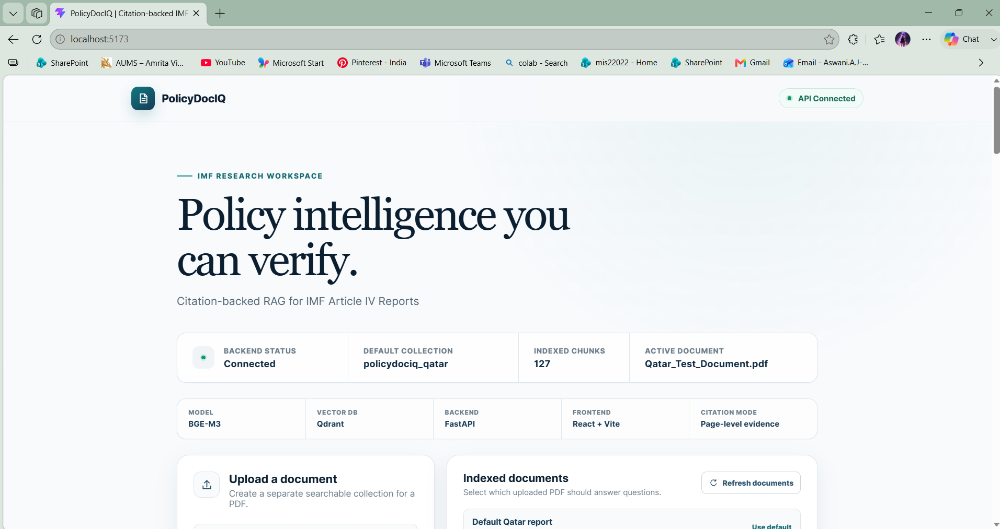
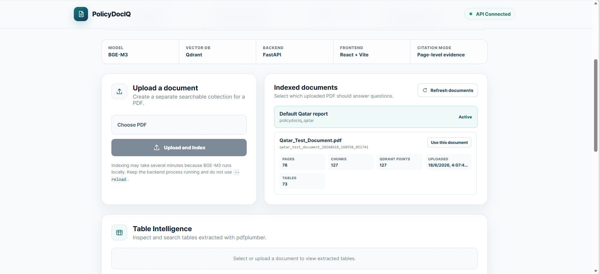
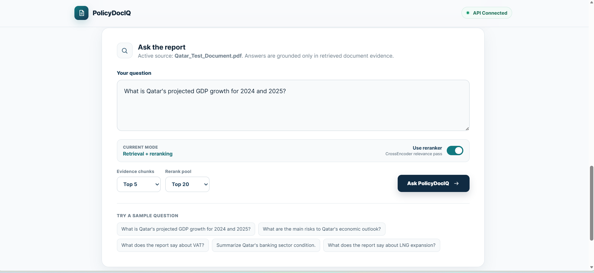
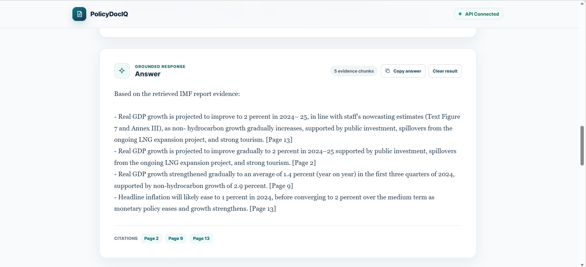
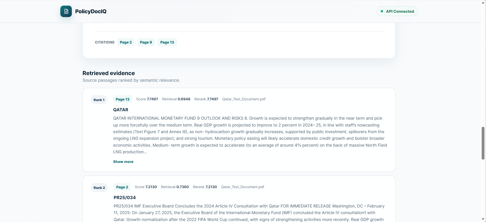
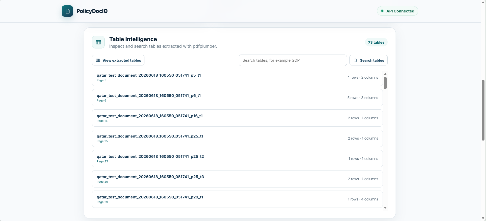

# 📄 PolicyDocIQ

**PolicyDocIQ** is a local, citation-backed document intelligence application for policy and economic PDF reports. It allows users to upload PDF reports, extract page-aware text, generate embeddings, store document chunks in Qdrant, retrieve relevant evidence, optionally rerank retrieved chunks, and answer user questions with page-level citations.

The project is designed for IMF Article IV reports and similar long-form economic policy documents. It focuses on grounded retrieval, explainable evidence, citations, multi-document support, and table extraction.

---

## Preview

### Dashboard



### Document Upload and Indexed Documents



### Ask the Report with Reranking




### Citation-Backed Answer



### Retrieved Evidence



### Table Intelligence



### Table Search Results


---

## Features

* FastAPI backend
* React + Vite frontend
* PDF page extraction using PyMuPDF
* Page-aware text chunking
* BGE-M3 embeddings on CPU
* 1024-dimensional dense vectors from BGE-M3
* Qdrant local vector storage
* Optional CrossEncoder reranking
* Citation-backed extractive answers
* Multi-document PDF upload
* Separate Qdrant collections for uploaded documents
* Document registry for uploaded PDFs
* pdfplumber-based table extraction
* Per-document table search for uploaded/indexed documents
* Cross-document table search across uploaded/indexed documents
* Backend Docker setup

---

## What This Project Does

PolicyDocIQ turns long PDF reports into searchable, citation-backed knowledge sources.

The main workflow is:

```text
PDF report
  -> page-level text extraction
  -> page-aware chunking
  -> BGE-M3 embedding generation
  -> Qdrant vector indexing
  -> semantic retrieval
  -> optional CrossEncoder reranking
  -> evidence-based answer with page citations
```

Table extraction workflow:

```text
PDF report
  -> pdfplumber table extraction
  -> tables.json and tables.csv
  -> keyword-based table search
  -> frontend table preview
```

---

## What This Project Does Not Do

This project does **not** claim to train large models from scratch.

PolicyDocIQ does not currently include:

* LLM training
* BGE-M3 training
* Fine-tuned LLM generation
* Full chart understanding
* Full image understanding
* GraphRAG
* Agentic workflows
* MCP integration

These can be future extensions, but they are not part of the current completed system.

---

## Tech Stack

| Layer               | Technology                           |
| ------------------- | ------------------------------------ |
| Backend             | FastAPI                              |
| Frontend            | React + Vite                         |
| PDF text extraction | PyMuPDF                              |
| Table extraction    | pdfplumber                           |
| Embeddings          | BAAI/bge-m3                          |
| Embedding dimension | 1024                                 |
| Vector database     | Qdrant local mode                    |
| Reranking           | cross-encoder/ms-marco-MiniLM-L-6-v2 |
| QA style            | Evidence-based extractive QA         |
| Backend packaging   | Docker                               |
| Languages           | Python, JavaScript                   |

---

## Architecture

```text
                       ┌──────────────────────┐
                       │      PDF Report       │
                       └──────────┬───────────┘
                                  │
                                  ▼
                       ┌──────────────────────┐
                       │   PyMuPDF Extraction  │
                       │  page text + metadata │
                       └──────────┬───────────┘
                                  │
                                  ▼
                       ┌──────────────────────┐
                       │ Page-Aware Chunking   │
                       │ chunk text + page no. │
                       └──────────┬───────────┘
                                  │
                                  ▼
                       ┌──────────────────────┐
                       │   BGE-M3 Embeddings   │
                       └──────────┬───────────┘
                                  │
                                  ▼
                       ┌──────────────────────┐
                       │   Qdrant Collection   │
                       └──────────┬───────────┘
                                  │
                                  ▼
User Question ───────▶ ┌──────────────────────┐
                       │  Semantic Retrieval   │
                       └──────────┬───────────┘
                                  │
                                  ▼
                       ┌──────────────────────┐
                       │ Optional Reranking    │
                       └──────────┬───────────┘
                                  │
                                  ▼
                       ┌──────────────────────┐
                       │ Evidence-Based QA     │
                       └──────────┬───────────┘
                                  │
                                  ▼
                       ┌──────────────────────┐
                       │ Answer + Citations    │
                       └──────────────────────┘
```

---

## Project Structure

```text
policydociq/
│
├── app/
│   ├── __init__.py
│   └── api.py
│
├── config/
│
├── data/
│   ├── .gitkeep
│   └── uploaded_documents/
│       └── .gitkeep
│
├── docs/
│
├── frontend/
│   ├── src/
│   │   ├── App.jsx
│   │   ├── App.css
│   │   └── index.css
│   ├── package.json
│   └── vite.config.js
│
├── outputs/
│   └── .gitkeep
│
├── screenshots_frontend/
│   ├── 01_home_dashboard.png
│   ├── 02_upload_and_indexed_documents.png
│   ├── 03_ask_report_reranker.png
│   ├── 04_answer_with_citations.png
│   ├── 05_retrieved_evidence.png
│   ├── 06_table_intelligence.png
│   └── 07_table_search_results.png
│
├── scripts/
│   ├── __init__.py
│   ├── 01_extract_and_chunk.py
│   ├── 02_index_qdrant.py
│   ├── 03_test_retrieval.py
│   ├── 04_test_qa.py
│   ├── 05_run_evaluation.py
│   ├── index_uploaded_document.py
│   ├── 07_test_reranking.py
│   ├── 08_compare_reranker_eval.py
│   └── 09_extract_tables_default.py
│
├── src/
│   ├── __init__.py
│   ├── pdf_loader.py
│   ├── chunker.py
│   ├── embedder.py
│   ├── retriever.py
│   ├── qa_engine.py
│   ├── reranker.py
│   ├── table_extractor.py
│   ├── document_manager.py
│   ├── evaluator.py
│   └── utils.py
│
├── tests/
│
├── Dockerfile
├── docker-compose.yml
├── .dockerignore
├── .gitignore
├── requirements.txt
└── README.md
```

---

## Setup

### 1. Clone the Repository

```bash
git clone https://github.com/Aswani1402/PolicyDocIQ.git
cd PolicyDocIQ
```

### 2. Create and Activate Virtual Environment

Windows:

```powershell
python -m venv .venv
.\.venv\Scripts\Activate.ps1
```

Linux/macOS:

```bash
python -m venv .venv
source .venv/bin/activate
```

### 3. Install Dependencies

```bash
pip install -r requirements.txt
```

Important packages include:

```text
fastapi
uvicorn
pydantic
pymupdf
pandas
sentence-transformers
qdrant-client
python-multipart
pdfplumber
```

The default extraction workflow uses PyMuPDF. Docling or OCR-based extraction is not required for the current working version.

---

## Run Backend Locally

Start FastAPI:

```bash
python -m uvicorn app.api:app --host 127.0.0.1 --port 8000
```

Do **not** use `--reload` with Qdrant local mode. Qdrant local storage should be accessed by only one backend or script process at a time.

Open Swagger UI:

```text
http://127.0.0.1:8000/docs
```

Health check:

```text
http://127.0.0.1:8000/health
```

---

## Run Frontend Locally

Open a second terminal:

```bash
cd frontend
npm install
npm run dev
```

Open:

```text
http://localhost:5173
```

---

## Default Qatar Report Workflow

PDF files are intentionally not committed to GitHub.

To use the default scripts, place an IMF Article IV PDF inside the `data/` folder. The default scripts were tested locally with:

```text
data/Qatar_Test_Document.pdf
```

If your PDF filename is different, update the PDF path inside the relevant script before running extraction or indexing.

The default Qdrant collection is:

```text
policydociq_qatar
```

Local Qdrant data is stored in:

```text
outputs/qdrant_db
```

### Extract and Chunk Default PDF

```bash
python scripts/01_extract_and_chunk.py
```

Expected outputs:

```text
outputs/extracted_pages.csv
outputs/extracted_chunks.csv
```

### Index Default PDF into Qdrant

```bash
python scripts/02_index_qdrant.py
```

### Test Retrieval

```bash
python scripts/03_test_retrieval.py
```

### Test Citation-Based QA

```bash
python scripts/04_test_qa.py
```

---

## Upload and Query PDFs

Users can upload PDFs from the frontend or through the API.

Upload using `curl`:

```powershell
curl.exe -X POST "http://127.0.0.1:8000/documents/upload" -F "file=@data/your_report.pdf"
```

After upload, the backend will:

```text
save PDF
-> extract page text
-> create page-aware chunks
-> generate BGE-M3 embeddings
-> create a document-specific Qdrant collection
-> extract tables
-> update document registry
```

Table extraction during upload is best-effort. If pdfplumber table extraction fails, document text indexing can still continue and the registry records the table error.

Uploaded files are stored in:

```text
data/uploaded_documents/
```

Per-document outputs are stored in:

```text
outputs/documents/{document_id}/
```

Document metadata is stored in:

```text
outputs/documents_registry.json
```

---

## Query the Default Qatar Report

```powershell
curl.exe -X POST "http://127.0.0.1:8000/query" `
  -H "Content-Type: application/json" `
  -d "{\"question\":\"What does the report say about VAT?\",\"top_k\":5,\"use_reranker\":true,\"rerank_pool\":20}"
```

---

## Query an Uploaded Document

Endpoint:

```text
POST /documents/{document_id}/query
```

Request body:

```json
{
  "question": "What does the report say about VAT?",
  "top_k": 5,
  "use_reranker": true,
  "rerank_pool": 20
}
```

Set `use_reranker` to `false` for retrieval-only mode.

When reranking is enabled:

```text
Qdrant retrieves rerank_pool chunks
-> CrossEncoder reranks them
-> best top_k chunks are passed to the QA engine
```

---

## Table Extraction and Search

Uploaded PDFs run table extraction automatically.

Extracted tables are stored under:

```text
outputs/tables/{document_id}/tables.json
outputs/tables/{document_id}/tables.csv
```

Extract tables from the default Qatar PDF:

```bash
python scripts/09_extract_tables_default.py
```

The default table script writes files to:

```text
outputs/tables/qatar_default/tables.json
outputs/tables/qatar_default/tables.csv
```

The table API endpoints read table metadata from `outputs/documents_registry.json`, so they are intended for uploaded and indexed documents. The frontend table panel also works with selected uploaded documents.

Table API endpoints:

```text
GET /documents/{document_id}/tables
GET /documents/{document_id}/tables/search?query=GDP
GET /tables/search?query=inflation
```

Table search is keyword-based and case-insensitive over flattened table text. It does not currently use embeddings.

---

## API Endpoints

### General

| Method | Endpoint      | Description                           |
| ------ | ------------- | ------------------------------------- |
| GET    | `/`           | API home                              |
| GET    | `/health`     | Health check                          |
| GET    | `/collection` | Default Qdrant collection information |

### Document QA

| Method | Endpoint                         | Description                    |
| ------ | -------------------------------- | ------------------------------ |
| POST   | `/query`                         | Query the default Qatar report |
| POST   | `/documents/{document_id}/query` | Query an uploaded document     |

### Documents

| Method | Endpoint            | Description                     |
| ------ | ------------------- | ------------------------------- |
| GET    | `/documents`        | List uploaded/indexed documents |
| POST   | `/documents/upload` | Upload and index a PDF          |

### Tables

| Method | Endpoint                                           | Description                             |
| ------ | -------------------------------------------------- | --------------------------------------- |
| GET    | `/documents/{document_id}/tables`                  | Get extracted tables for one document   |
| GET    | `/documents/{document_id}/tables/search?query=GDP` | Search tables inside one document       |
| GET    | `/tables/search?query=inflation`                   | Search tables across uploaded documents |

---

## Reranker Test

```bash
python scripts/07_test_reranking.py
```

This script compares:

```text
top retrieved pages before reranking
top retrieved pages after reranking
citations after reranking
answer after reranking
```

---

## Evaluation

Run the basic evaluation:

```bash
python scripts/05_run_evaluation.py
```

Expected outputs:

```text
outputs/evaluation_results.csv
outputs/evaluation_summary.json
```

Run reranker comparison evaluation, if available:

```bash
python scripts/08_compare_reranker_eval.py
```

Expected outputs:

```text
outputs/reranker_comparison_results.csv
outputs/reranker_comparison_summary.json
```

Evaluation can track:

* Page hit rate
* Keyword hit rate
* Citation pages
* Answer availability
* Latency
* Retrieval-only vs reranked results

---

## Docker Backend

Build Docker image:

```bash
docker build -t policydociq-backend .
```

Run container:

```bash
docker run -p 8000:8000 -v ${PWD}/outputs:/app/outputs -v ${PWD}/data:/app/data policydociq-backend
```

Using Docker Compose:

```bash
docker compose up --build
```

Open:

```text
http://127.0.0.1:8000/docs
```

Stop any local FastAPI process before running Docker, because both processes may try to access:

```text
outputs/qdrant_db
```

---

## Example Questions

```text
What is Qatar's projected GDP growth for 2024 and 2025?
```

```text
What are the main risks to Qatar's economic outlook?
```

```text
What does the report say about VAT?
```

```text
Summarize Qatar's banking sector condition.
```

```text
What does the report say about LNG expansion?
```

```text
What does the report say about inflation?
```

```text
What does the report say about public debt?
```

---

## Known Limitations

* The current system supports text retrieval and table extraction; it is not full chart understanding.
* It does not use local LLM generation yet.
* It does not train BGE-M3.
* It does not train an LLM.
* The QA engine is evidence-based and extractive, not a full generative LLM.
* Table extraction quality depends on PDF layout.
* Table search is keyword-only.
* Scanned PDFs may need OCR.
* Complex merged-cell tables may not extract cleanly.
* Qdrant local mode should be accessed by one backend or script process at a time.
* CPU model loading and first-query latency can be significant.
* Reranking can improve evidence quality but increases latency.
* The system does not verify financial calculations beyond retrieved evidence.

---

## Future Work

Planned improvements include:

* Better table structure normalization
* OCR support for scanned reports
* Chart and figure extraction
* Local LLM integration
* Hybrid retrieval
* Advanced evaluation dashboard
* Dockerized frontend
* Production Qdrant server deployment
* Multi-report comparison
* Report-level summarization

---

## Resume-Safe Description

```text
Built PolicyDocIQ, a citation-backed document intelligence RAG system for IMF Article IV reports using PyMuPDF PDF ingestion, page-aware chunking, BGE-M3 embeddings, Qdrant retrieval, cross-encoder reranking, FastAPI APIs, React frontend, multi-document PDF upload, and pdfplumber-based table extraction.
```

Short version:

```text
Developed a citation-backed RAG system for economic policy PDFs with document upload, BGE-M3 embeddings, Qdrant retrieval, reranking, FastAPI, React, and table extraction.
```

---

## Project Summary for Recruiters and Reviewers

### What problem does this solve?

Policy and economic reports such as IMF Article IV documents are long, dense, and difficult to search manually. Important information about GDP growth, inflation, fiscal policy, banking stability, public debt, risks, and reforms may be spread across many pages, tables, and annexes.

PolicyDocIQ solves this by turning a long PDF report into a searchable, citation-backed knowledge source. Instead of manually scanning the full report, a user can ask a question and receive an evidence-based answer with page citations and retrieved source passages.

### Can someone run it?

Yes. The project can be run locally.

The backend runs with FastAPI, and the frontend runs with React + Vite. The system uses local open-source components such as PyMuPDF, BGE-M3, Qdrant local mode, CrossEncoder reranking, and pdfplumber. No paid LLM API is required for the current version.

A user can run the backend, start the frontend, upload a PDF, ask questions, view cited evidence, and inspect extracted tables.

### What did I build?

I built an end-to-end document intelligence RAG application for economic policy PDFs.

The system includes:

* PDF text extraction with page metadata
* Page-aware chunking
* BGE-M3 embedding generation
* Qdrant vector indexing and retrieval
* Optional CrossEncoder reranking
* Citation-backed extractive question answering
* Multi-document PDF upload
* Separate collections for uploaded documents
* Table extraction using pdfplumber
* Table keyword search
* FastAPI backend APIs
* React + Vite frontend interface
* Backend Docker setup

### What is completed?

The completed version supports the full local RAG workflow:

```text
PDF upload or default PDF selection
-> text extraction
-> chunking
-> embedding
-> Qdrant indexing
-> retrieval
-> reranking
-> citation-backed answer display
```

The frontend shows backend status, indexed document information, upload controls, active document selection, question answering, citations, retrieved evidence, reranker controls, and table intelligence features.

Table extraction is also implemented for supported PDF layouts, and extracted tables can be viewed or searched using keyword search.

### What is still limited?

The project is not a full multimodal system yet. It does not understand charts, figures, or scanned image-based PDFs unless OCR is added later.

The current QA engine is evidence-based and extractive, not a full generative LLM. The system does not train BGE-M3 or train an LLM. Table extraction depends on the PDF layout, so complex merged-cell tables or scanned reports may not always extract perfectly.

Qdrant is currently used in local mode, so only one backend or script process should access the local vector database at a time.

### Why should a recruiter care?

This project demonstrates practical AI engineering skills beyond a simple notebook. It combines backend development, frontend development, document processing, embeddings, vector search, reranking, citation-aware answer generation, table extraction, API design, and local deployment.

It shows that I can build and integrate a working AI application using modern open-source tools, test it locally, expose it through APIs, and present it through a usable frontend. The project is especially relevant for AI/ML, RAG, GenAI application development, Python backend, and document intelligence roles.

---

## Author

Aswani A J
B.Tech Artificial Intelligence
Amrita Vishwa Vidyapeetham

---

## License

This project is for academic, learning, and portfolio purposes.
